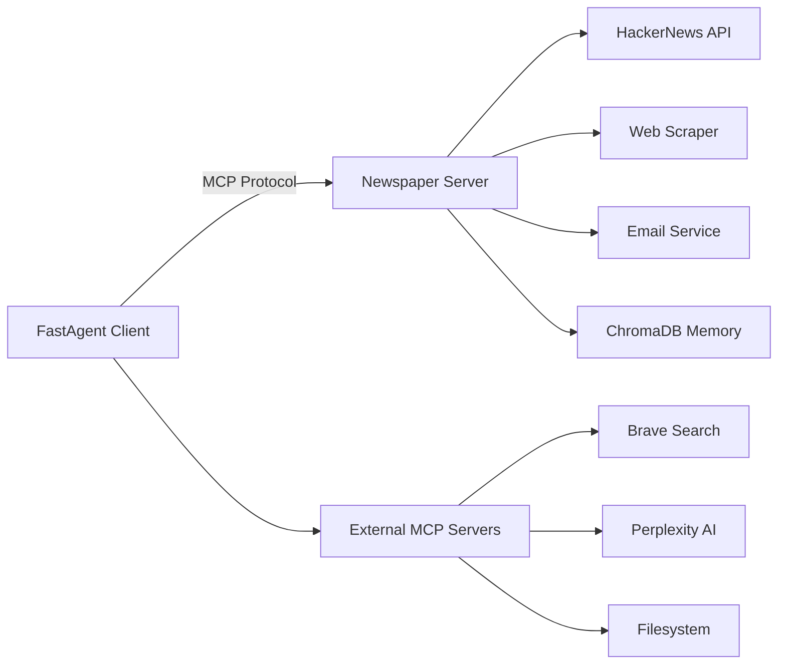

<div align="center">

# Agentic AI Workshop: Newspaper Creation Agent

[](https://www.python.org/downloads/)
[](https://github.com/jlowin/fastmcp)
[](LICENSE)


A comprehensive educational project demonstrating agentic AI through the Model Context Protocol (MCP). Build a personalized newspaper creation system using collaborative agents, vector memory, and modern AI patterns.

</div>

## Overview

This repository contains a complete implementation of an agentic AI system that aggregates, filters, and formats news from multiple sources into personalized newspapers. The project serves as both a functional application and an educational resource for understanding agentic AI architecture.

**Core Concepts Demonstrated:**
- Model Context Protocol (MCP) server and client implementation
- Tool calling and function composition
- Context management and memory systems
- Multi-agent collaboration patterns
- Production-ready error handling and logging

## Architecture



<table>
<tr>
<td width="50%">

**Client Layer**
- FastAgent orchestration
- Multi-server coordination
- Interactive agent loops

</td>
<td width="50%">

**Server Layer**
- Custom newspaper tools
- Content fetching & extraction
- Memory management
- Email delivery

</td>
</tr>
</table>

## Quick Start

### Prerequisites

```bash
python >= 3.13.7
uv (recommended) or pip
```

### Installation

```bash
# Clone repository
git clone https://github.com/yourusername/news-agent.git
cd news-agent

# Install client dependencies
cd client
uv pip install -e .

# Install server dependencies
cd ../src/server
uv pip install -e ../../notebooks

# Configure secrets
cp client/fastagent.secrets.yaml.example client/fastagent.secrets.yaml
# Edit fastagent.secrets.yaml with your API keys
```

### Running the Agent

```bash
cd client
python news-agent-client.py
```

## Project Structure

<details>
<summary>Click to expand directory tree</summary>

```
.
├── client/
│   ├── news-agent-client.py          # Main agent client
│   ├── fastagent.secrets.yaml.example # API key template
│   └── pyproject.toml
├── src/server/
│   ├── config/
│   │   ├── settings.py                # Pydantic configuration
│   │   └── constants.py               # HTTP headers, limits
│   ├── services/
│   │   ├── http_client.py             # HTTP with retry logic
│   │   ├── email_service.py           # SMTP newspaper delivery
│   │   └── interests_file.py          # User preference management
│   ├── templates/
│   │   └── newspaper_email.html       # Jinja2 newspaper template
│   └── weather_server.py              # Example MCP server
├── notebooks/
│   ├── 01_basic_tools.py              # Session 1: Foundation
│   ├── 02_memory_context.py           # Session 2 (Oct 8 release)
│   └── 03_multi_agent.py              # Session 3 (Oct 15 release)
└── README.md
```
</details>

## Key Features

### MCP Tool Suite

| Tool | Purpose | Key Parameters |
|------|---------|----------------|
| `fetch_hn_stories` | Retrieve top HackerNews stories | count (1-30) |
| `fetch_article_content` | Extract clean content from URLs | url |
| `create_newspaper_draft` | Initialize newspaper with sections | title, subtitle, sections[] |
| `add_article_to_newspaper` | Add article to section with scoring | newspaper_id, section, content, score |
| `preview_newspaper` | Review before sending | newspaper_id |
| `send_newspaper_email` | Deliver via SMTP | newspaper_id |

### Memory & Context Management

> [!IMPORTANT]
> Context window management is critical for production agents. This project demonstrates semantic compression, conversation compaction, and strategic tool result caching.

```python
# Example: Intelligent content summarization to manage context
@mcp.tool()
async def fetch_with_summary(url: str, style: str = "detailed") -> str:
    """Fetch and summarize based on context budget"""
    content = await fetch(url)
    if len(content) > MAX_CONTEXT:
        return await compress_semantically(content, style)
    return content
```

## Educational Resources

### Workshop Notebooks

**Session 1: Building the Foundation** *(Available Now)*
- Evolution from simple LLM calls to tool-using agents
- MCP server implementation with FastMCP
- Anti-patterns and debugging strategies
- The "context bursting" problem

**Session 2: Memory & Context** *(Releasing October 8, 2025)*
- ChromaDB vector storage integration
- MCP sampling and elicitation features
- Conversation compression techniques
- Strategic context management

**Session 3: Multi-Agent Collaboration** *(Releasing October 15, 2025)*
- Multi-agent newspaper personalization
- Predictive intelligence patterns
- Production hosting strategies
- Agent orchestration workflows

### Running Notebooks

```bash
cd notebooks
jupyter notebook 01_basic_tools.py
```

> [!TIP]
> Notebooks are designed as "technical story-telling" - run cells sequentially to watch concepts build progressively.

## Configuration

<details>
<summary>Environment Variables</summary>

```yaml
# fastagent.secrets.yaml
openai:
  api_key: <your-key>
anthropic:
  api_key: <your-key>

mcp:
  servers:
    brave:
      env:
        BRAVE_API_KEY: <your-key>
    perplexity_mcp:
      env:
        PERPLEXITY_API_KEY: <your-key>
```
</details>

<details>
<summary>Server Settings</summary>

```python
# Customize in src/server/config/settings.py
class NewsSettings(BaseSettings):
    default_story_count: int = 5
    summary_style: str = "brief"  # brief|detailed|technical
    sources: list[str] = ["hackernews"]

class HttpSettings(BaseSettings):
    timeout: float = 15.0
    max_retries: int = 3
    retry_backoff_factor: float = 1.0
```
</details>

## Development

### Adding Custom Tools

```python
@mcp.tool()
async def your_custom_tool(param: str, ctx: Context = None) -> str:
    """Your tool description for the LLM"""
    # Access services from context
    service = ctx.request_context.lifespan_context.your_service
    return await service.process(param)
```

### Testing MCP Servers

```bash
# Run server standalone for testing
cd src/server
python -m fastmcp dev weather_server.py
```

## Authors

<table>
<tr>
<td width="50%">

**Adi Singhal**

AWS AI/ML Engineer working on Amazon Q

[](https://www.linkedin.com/in/adi-singhal/)

</td>
<td width="50%">

**Luca Chang**

AWS Agentic AI Organization, MCP Contributor

[](https://www.linkedin.com/in/luca-chang/)

</td>
</tr>
</table>

**Note:** This project is an independent, personal initiative and is not affiliated with, endorsed by, or representative of Amazon Web Services (AWS) or Amazon.com, Inc. The views and opinions expressed here are solely those of the individual contributors and do not reflect the official policy or position of their employers.

## Academic Context

This project emerged from a graduate-level workshop series on agentic AI systems. The codebase emphasizes:
- **Pedagogical Clarity**: Code structured for learning, not just functionality
- **Progressive Complexity**: Concepts build from fundamentals to advanced patterns
- **Production Patterns**: Real-world considerations like error handling, retry logic, and context management
- **Research-Oriented**: Demonstrates current best practices in agentic AI architecture

## Contributing

Contributions welcome! Key areas:
- Additional news source integrations
- Alternative memory backends (Pinecone, Weaviate)
- Enhanced summarization strategies
- Multi-modal content support

## License

MIT License - See [LICENSE](LICENSE) for details

---

> **Note**: This is an educational project demonstrating MCP and agentic AI patterns. For production use, additional security hardening and rate limiting are recommended.
